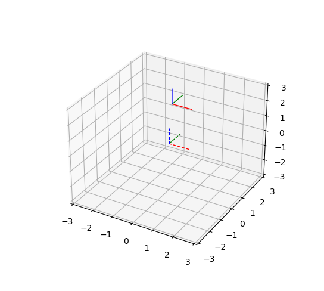
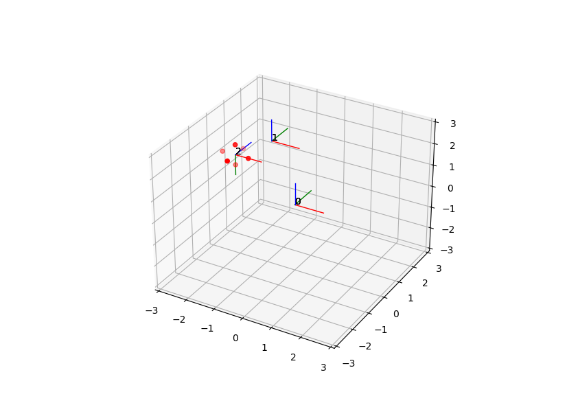
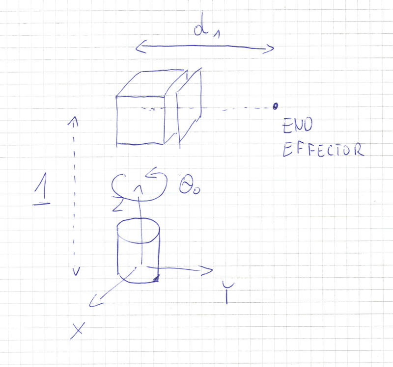
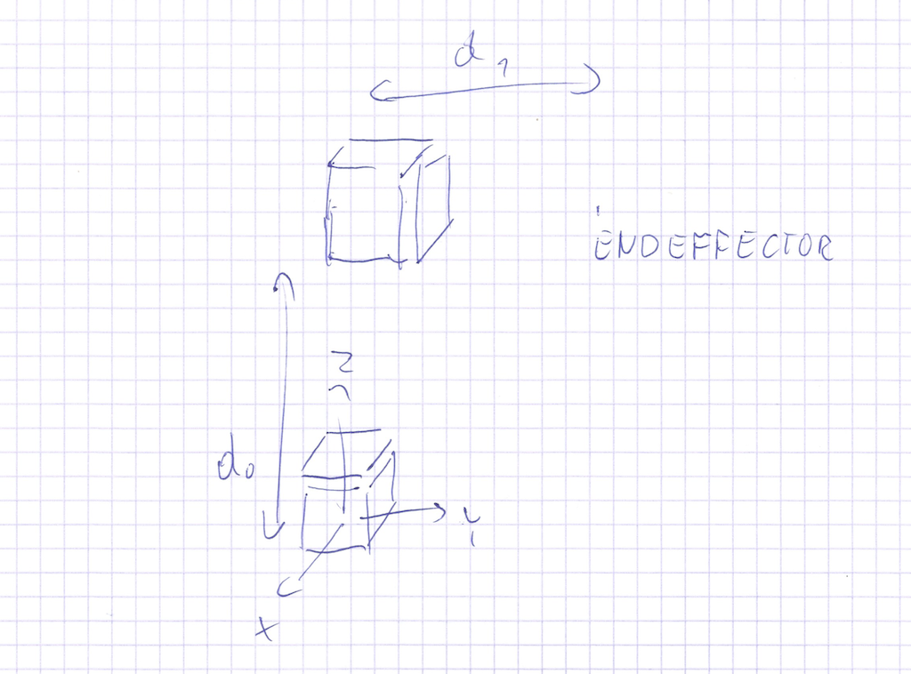

<script type="text/javascript" id="MathJax-script" async
   src="https://cdn.jsdelivr.net/npm/mathjax@3/es5/tex-mml-chtml.js">
</script>

# Lab 12

This lab serves as a basis for the theoretical part of the exam.

## Problem 1

There are 8 subproblems of this problem. You can find them in `task_1.py` file. You can run them by typing `python task_1.py <number>` where `<number>` is a number of subproblem. For instance if you want to run the first subproblem you should type `python task_1.py 1`.

https://github.com/mim-ml-teaching/robot-control-teaching-materials/blob/546d19916135f9bcc4c8292a617b0cc41ccfb7ec/lab12_files/task_1.py#L1-L66




Each of eight subproblems contains: 3D plot of base coordinate frame (dashed lines) and transformed frames (solid lines).

You can zoom in, zoom out, move around 3D plot. Colors used follow RGB convention red is axis X, green is axis Y, and blue is axis Z.

Your task is to find a transformation from base frame to transformed frame on paper.

Take a look at program source code to find out what was the correct transformation.

## Problem 2

Write a python program, that takes as an input:

1. Series of transformations from base frame to end effector frame described by (4x4) matrices.
2. Point cloud with respect to end effector frame.

and produces a matplotlib 3D plot containing:

1. All frames (labeled by number)
2. Transformed point cloud

For two matrices:

```
matrix_1 = [
    [1, 0, 0, -2],
    [0, 1, 0, 2],
    [0, 0, 1, 1],
    [0, 0, 0, 1]
]

matrix_2 = [
    [ 1  0  0 -2],
    [ 0  0  1  1],
    [ 0 -1  0 -1],
    [ 0  0  0  1]
]

```

and point cloud
```
points = 
[[ 0.5  0.   0. ]
 [-0.5  0.   0. ]
 [ 0.   0.5  0. ]
 [ 0.  -0.5  0. ]
 [ 0.   0.   0.5]
 [ 0.   0.  -0.5]]
```

Output of the function call 

```
plot_frames_and_points([matrix_1, matrix_2], points)
```

could be:



## Problem 3

### Task 3-1

Robot has two joints. First joint is revolute, second joint is prismatic with $d >= 0$. Robot base is located at $(0,0,0)$.
Joints are connected by a link of length $1$.
Second joint is rotated around $𝑍$ axis by 90 degrees as in an image below:



When  $𝜃_0=0$ and $𝑑_1=1$ location of end effector wrt base is  (0,1,1) 

Find:

1. Forward kinematics transformation of end effector
2. Workspace of the robot (set of points achievable by end-effector).
3. Inverse kinematics equation in a closed form
4. Write in python program implementing steps 1 and 3.


### Task 3-2

Robot has two prismatic joints with $𝑑 >= 0$. Robot base is located at $(0,0,0)$.
Joints are connected by a link of length 1. Second joint is rotated around $𝑋$ axis by 90 degrees as in an image below:



When $𝑑_0=1$ and  $𝑑_1=1$ location of end effector wrt base is  (0,1,2) 

Find:

1. Forward kinematics transformation of end effector
2. Workspace of the robot (set of points achievable by end-effector).
3. Inverse kinematics equation in a closed form
4. Write in python program implementing steps 1 and 3.
