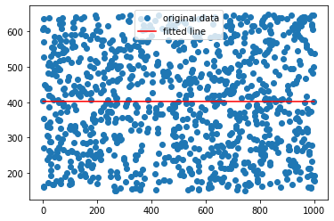
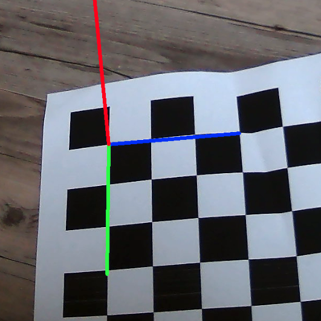
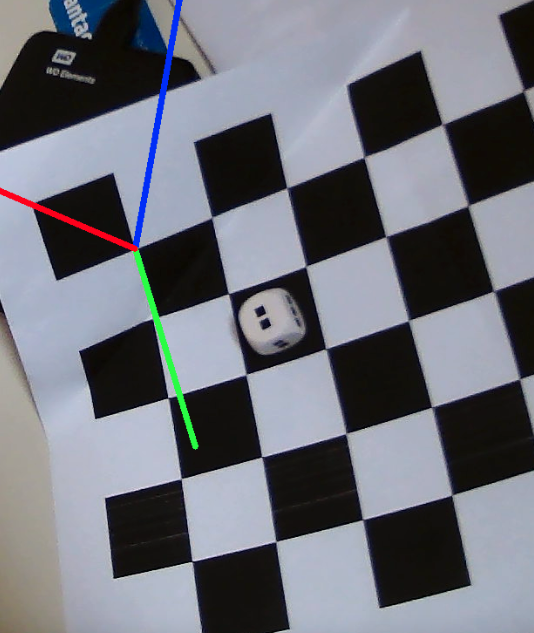

# General info

During this lab we are going to perform pose estimation of calibration patterns we have already printed.
We could do it with any object with physically known and detectable features (like marker or chessboard corners), so feel free to experiment.

The task is similar to already known techniques from lab 3.

## Summary

There are four tasks

1. Run RANSAC on synthetic data
2. Run solvePnP on chessboard
3. Run own version of RANSAC and solvePnP on chessboard
4. Run solvePnPRansac on chessboard


# RANSAC

Random sample consensus (RANSAC) is an iterative method to estimate parameters of a mathematical model from a set of observed data that contains outliers, when outliers are to be accorded no influence on the values of the estimates [(wiki)](https://en.wikipedia.org/wiki/Random_sample_consensus)

It can be useful when we are estimating a pose based on positions of features (in pixel space), some
of which are terribly misplaced. To begin with we will start with our own version of RANSAC.

We will start with some almost random data (only 5% of points - almost linear function, 95% - random noise)

```python
import random
import matplotlib.pyplot as plt
from scipy import stats
import numpy as np

def value(alpha = 0.95):
    x = 1000 * random.random()
    y = 0.5 * x + random.gauss(0, 3) + 150
    if random.random() < alpha:
        y = random.uniform(150, 650)
    return x, y

values = [value() for _ in range(1000)]
values.sort()

x = np.array([v[0] for v in values])
y = np.array([v[1] for v in values])
res = stats.linregress(x, y) 
plt.plot(x, y, 'o', label='original data')
plt.plot(x, res.intercept + res.slope*x, 'r', label='fitted line')
plt.legend()
```



As we can see linear regression from stats package found a line that tries to fit both the data and the noise.

Can we do it better?

Let's take a look at an RANSAC algorithm:

```
Given:
    data – A set of observations.
    model – A model to explain observed data points.
    n – Minimum number of data points required to estimate model parameters.
    k – Maximum number of iterations allowed in the algorithm.
    t – Threshold value to determine data points that are fit well by model.
    
Return:
    bestFit – model parameters which best fit the data (or null if no good model is found)

iterations = 0
bestPointCount = 0

while iterations < k do
    maybeInliers := n randomly selected values from data
    maybeModel := model parameters fitted to maybeInliers
    alsoInliers := empty set
    for every point in data not in maybeInliers do
        if point fits maybeModel with an error smaller than t
             add point to alsoInliers
        end if
    end for
    if the number of elements in maybeInliers and alsoInliers is > bestPointCount then
        // This implies that we may have found a good model
        betterModel := model parameters fitted to all points in maybeInliers and alsoInliers
        bestPointCount := number of elements in maybeInliers and alsoInliers
    end if
    increment iterations
end while

return bestFit
```

We could use it  with following parameters:

* `k` - number of iterations set to `100`
* `n` - number of elements in sample set to `2` (only two points!)
* `t` - threshold (squared distance) set to `10`

In our solution results are following:


As we can see algorithm is able to overcome `95%` of noise.

**Task 1 of 4**

Fill the TODOs:

```
best_diff = None
for k in range(100):
    sample = random.sample(values, 2)
    # TODO: perform linear regression based on sample
    # TODO: add datapoints to alsoInliers
    # TODO: calc how many points are in maybeInliers and alsoInliers
    # TODO: update the best model if needed
    # TODO: plot the results
```

## Solution (hint)

Here you are given as a hint a slightly different version of RANSAC (calculates square loss for updating model)

<details>
  <summary>Click to expand!</summary>

<pre>
best_diff = None
for k in range(1000):
    sample = random.sample(values, 2)
    sample_x = np.array([v[0] for v in sample])
    sample_y = np.array([v[1] for v in sample])
    res = stats.linregress(sample_x, sample_y) 
    for v in values:
        if v in sample:
            continue
        if ((v[0] * res.slope + res.intercept) - v[1])**2 < 10:
            sample.append(v)
    diff = 0
    for v in sample:
        diff += ((v[0] * res.slope + res.intercept) - v[1])**2 / len(sample)
    if len(sample) < 40:
        continue
    if best_diff is None or diff < best_diff:
        best_diff = diff
        best_model = res

x = np.array([v[0] for v in values])
y = np.array([v[1] for v in values])
plt.plot(x, y, 'o', label='original data')
plt.plot(x, best_model.intercept + best_model.slope*x, 'r', label='fitted line')
plt.legend()
</pre>

</details>

# Pose estimation using solvePnP


Pose estimation is a task of estimating rotation (output) and the translation (output) vectors that transform a 3D point expressed in the object coordinate frame to the camera coordinate frame from correspondence between 2D points on photo (input) and 3D points of objects (input). [3D pose estimation](https://en.wikipedia.org/wiki/3D_pose_estimation)

`cv2.solvePnP` function is one of many OpenCV functions able to perform pose estimation (without using RANSAC)
[docs](https://docs.opencv.org/4.x/d9/d0c/group__calib3d.html#ga549c2075fac14829ff4a58bc931c033d).

As parameters it takes:
* array of object points in the object coordinate space (3D)
* array of corresponding image points (2D)
* cameraMatrix estimated by `cv2.calibrateCamera`
* distCoeffs estimated by `cv2.calibrateCamera`

In fact, we have already used `cv2.solvePnP` in lab3, it was disguised as `cv2.estimatePoseSingleMarkers`, but actually it was just solveP4P from four corners of a marker.
    
During the last lab we have estimated cameraMatrix and distCoeffs of our cameras. We can find chessboard corners on the image using `cv2.findChessboardCorners` function. We also know our chessboard object measurements.

**Task 2 of 4**

Using `cv2.solvePnP` and `cv2.projectPoints` (projects 3D points to 2D image, refer to lab3) write a program that draws 
3D coordinate system with (0,0,0) at one corner of the chessboard with X, Y and Z axes as on image below:



You can use following code for drawing axes
```python
def coordinates(point):
    return [int (i) for i in tuple(point.ravel())]

def draw(img, corners, imgpts):
    corner = coordinates(corners[0].ravel())
    img = cv.line(img, corner, coordinates(imgpts[0]), (255,0,0), 5)
    img = cv.line(img, corner, coordinates(imgpts[1]), (0,255,0), 5)
    img = cv.line(img, corner, coordinates(imgpts[2]), (0,0,255), 5)
    return img
```

# Noisy data

Sometimes the data points may be noisy what can lead to poor results in pose estimation like on the image below:



## Tasks:

**Task 3 of 4**

1. Make the output of `cv2.findChessboardCorners` noisy, either by physically bending the chessboard sheet or by adding some artificial noise to `cv2.findChessboardCorners` result. For example choose a few points to disturb slightly and choose a few points to make them completely random.
2. Check (with your eyes) the results of `cv2.solvePnP` on noisy data.
3. Implement your own version of `cv2.solvePnP` with RANSAC (only use `cv2.solvePnP`, RANSAC implementation should be yours).


**Task 4 of 4**

Compare your results with `cv.solvePnPRansac`. Check:
- accuracy (with your own eyes or against original, not disturbed data)
- running speed
- check against different RANSAC parameters
