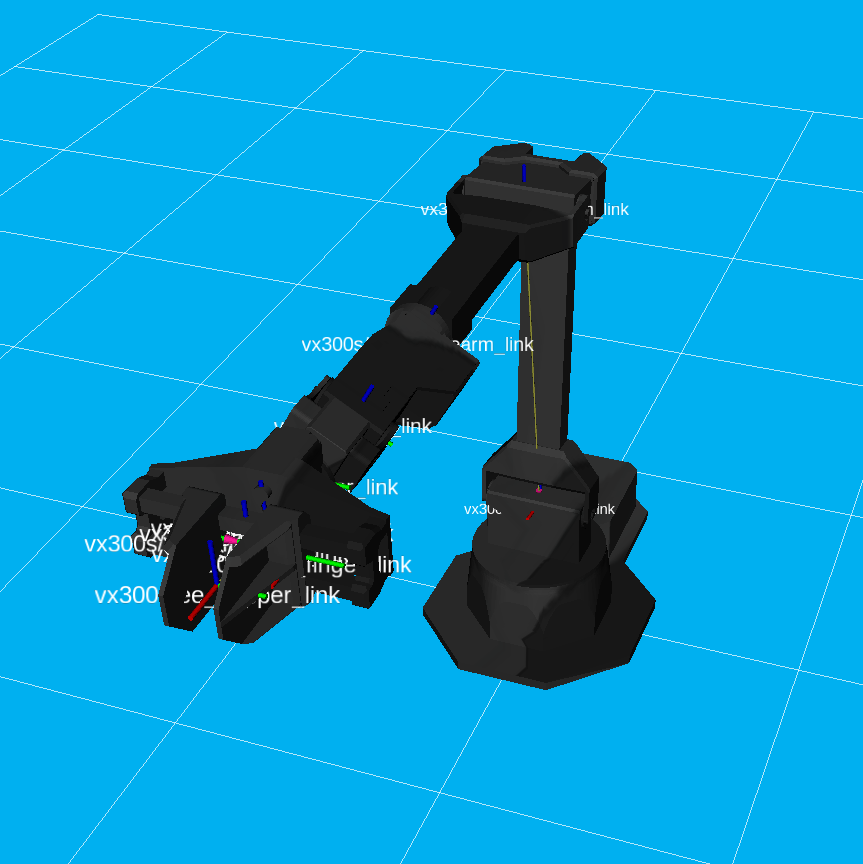
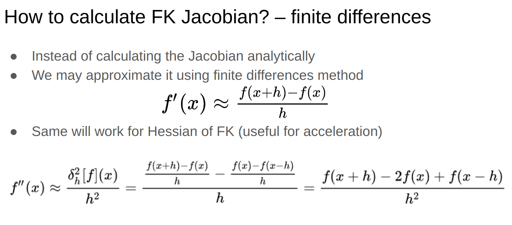
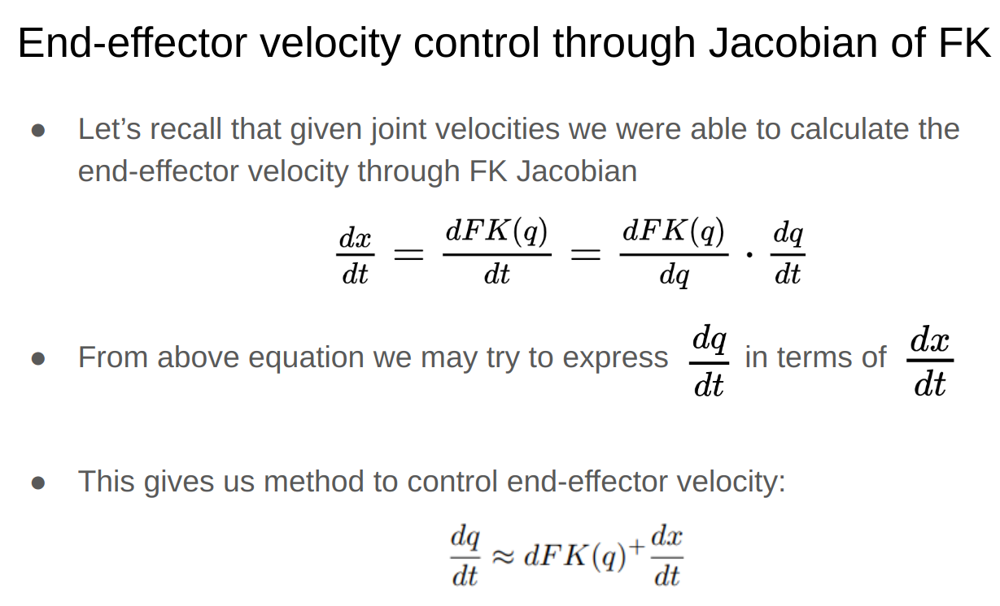
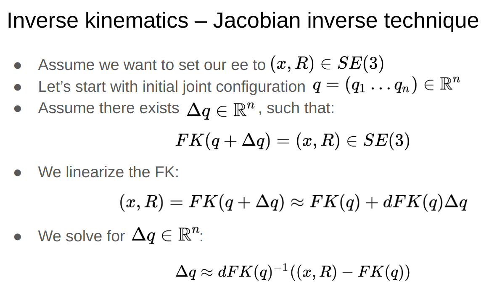

# Inverse kinematics Lab
## ROS — Robot operating system
[ROS](https://en.wikipedia.org/wiki/Robot_Operating_System) – robot operating system is widely used message passing framework for robotics. We will use it to control the viper x300 6dof robotic arm.
There are many existing software packages for robotics implemented using ROS or with ROS support including:
* Algorithms for robotics: localization, mapping, path planning, SE(3) poses manipulation and many more
* Visualization systems such as rviz
* Physics simulation systems such as gazebo

## Environment installation
We will install environment for viper x300 support according to the [official documentation](https://docs.trossenrobotics.com/interbotix_xsarms_docs/index.html) (more or less).

### Setting up the virtual machine
```shell
snap install multipass
```

```shell
multipass launch -n viper-lab -d 20G -m 4G -c 2
```

```shell
multipass shell viper-lab
```

```shell
$ curl 'https://raw.githubusercontent.com/Interbotix/interbotix_ros_manipulators/main/interbotix_ros_xsarms/install/amd64/xsarm_amd64_install.sh' > xsarm_amd64_install.sh
$ chmod +x xsarm_amd64_install.sh 
$ ./xsarm_amd64_install.sh -d rolling
```
You should answer no to questions about installing Camera drivers and matlab, and at the end you should answer yes to the question about installing the Interbotix SDK.

### Setting up the X Server
The Interbotix SDK uses the X Server to display the robot in RViz. We need to install the X Server on the virtual machine. I recomend using X11 forwarding as described in https://multipass.run/docs/set-up-a-graphical-interface#heading–x11-on-linux.

#### Step by step
```shell
$ sudo apt install xorg-xserver
```
```shell
multipass exec viper-lab -- bash -c "echo `cat ~/.ssh/id_rsa.pub` >> ~/.ssh/authorized_keys"
```
```shell
multipass list
```
```shell
# replace `xx.xx.xx.xx` with the IP address obtained above
ssh -Y ubuntu@xx.xx.xx.xx
```

### Finally, launching up the environment
```shell
. ./interbotix_ws/build/install/setup.bash
ros2 launch interbotix_xsarm_control xsarm_control.launch.py robot_model:=vx300s use_sim:=true
```

After running commands above you should get the visualization of the robot state in the rviz.



## Tasks for today
You have been given an arm controller that is capable of calculating the forward kinematics of the robot and linear movements in joint space `movej`.
Note that it is not the same as the linear movements in the cartesian ee-space, which you will be implementing as the `movel` function.  
Your tasks are:
* Implement calculation of the jacobian of the inverse kinematics
* Linear movements in cartesian space
* Inverse kinematics

Stubs for tasks are available in the `docs/lab_viper_files/task.py`.

```python

class Controller:
    def __init__(self):
        self.manipulator = InterbotixManipulatorXS(
            robot_model='vx300s',
            group_name='arm',
            gripper_name='gripper'
        )
        self.home_qs = self.get_qs()

    def forward_kinematics(self, qs: np.ndarray) -> np.ndarray:
        ee_pose = mr.FKinSpace(
            self.manipulator.arm.robot_des.M,
            self.manipulator.arm.robot_des.Slist,
            qs
        )

        return ee_pose

    def get_qs(self) -> np.ndarray:
        return np.array([
            self.manipulator.core.joint_states.position[self.manipulator.core.js_index_map[name]]
            for name in self.manipulator.arm.group_info.joint_names
        ])

    def movej(self, qs: np.ndarray, moving_time=1.):
        self.manipulator.arm._publish_commands(qs, moving_time=moving_time)

    def open_gripper(self):
        self.manipulator.gripper.release()

    def close_gripper(self):
        self.manipulator.gripper.grasp()

    def move_home(self):
        self.manipulator.arm.go_to_home_pose()
```
...

### Jacobian calculation

```python
def jacobian(self, qs: np.ndarray) -> np.ndarray:
    """ TODO: implement jacobian calculation based using finite differences """
```

### Linear movements

```python
def movel(self, x: np.ndarray, velocity=.01, tolerance=0.03):
    """ TODO: implement robot movement linear in the cartesian end-effector space. """

```

### Inverse kinematics

```python
def inverse_kinematics(self, x: np.ndarray, tolerance=0.03, learning_rate=0.01) -> np.ndarray:
    """ TODO: implement jacobian based method of solving inverse kinematics """
```

### Wrapping task
After implementing all of the functions above, you can test them using the following:
* Robot first move linearly to a specified position
  * Chosen position is close to the singularity, so you will be able to see the speedy movements of the joints
* Calculate the inverse kinematics to the original position
* Return to the position using `movej`

```python
def main():
    controller = Controller()
    controller.move_home()

    target = controller.get_ee_position()
    home = copy.deepcopy(target)

    target[2, 3] -= 0.1
    target[0, 3] = 0.15

    controller.movel(target)
    controller.movej(controller.inverse_kinematics(home))
```

## Bonus task (0.5 grade higher)
* Add gazebo simulation and render a scene with some objects placed randomly in the scene
* Add camera to the gazebo simulation
* Pick the objects based on the camera input 
* We will be having real robots like that so after finishing this task you may swap gazebo sim for the real robot if you want