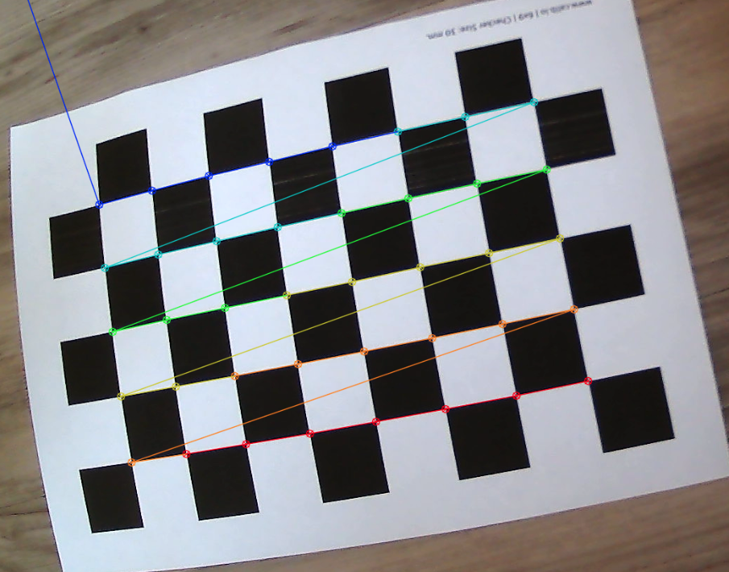
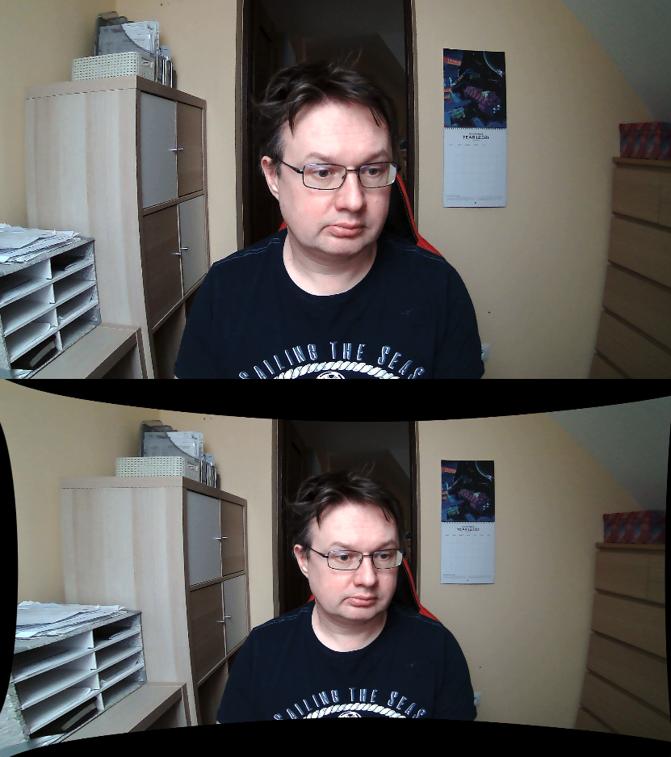

# Intro

During the lecture we have introduced the pinhole camera model.
In the real world cameras have lenses. To get more intuition on
how the focal length and aperture influence the depth of field
we recommend going through [this blogpost](https://ciechanow.ski/cameras-and-lenses/)
with great visualizations.
During the lab session do not spend more than 15 minutes on the blogpost
to have enough time for the rest of the lab scenario.

# General info

During this lab we are going to calibrate the provided cameras based on the series of images captured.

This will be the first time we will work with OpenCV locally.
It should not be too different from the Colab, but remember to call `cv2.waitKey()` after every `cv2.imshow()`.
Installing should be simple: you can use your distro package manager or pip.

```bash
# Ubuntu
sudo apt-get install python3-opencv
# Arch, etc.
sudo pacman -S python-opencv
```

Or with pip in a venv:

```bash
python3 -m venv opencv_venv
. opencv_venv/bin/activate # Use this line every time you open a new terminal session
pip install opencv-python
python -c 'import cv2' # Check if module was found
```

[This resource](https://docs.opencv.org/4.x/dc/dbb/tutorial_py_calibration.html) can be useful as a reference.

# Cameras

[Here are instructions](cameras.md) on how to work with provided cameras.
We assume that at this point you can successfully get frames (display stream) from the camera.
Please note, that we are always calibrating a certain camera resolution.
This means calibration matrix and distortion coefficients acquired on 800x600 resolution will not work on 1280x720 resolution.

You can choose resolution for today, just don't go too low (640x480 or quality 8 is probably the lowest recommended value).

# Distortions

Our cameras cameras introduce distortion to images. We will take care only of two types of distortions
during this lab:
- radial distortion and 
- tangential distortion.

Radial distortion causes straight lines to appear curved.


Tangential distortion makes a "tilted" effect. 


Our goal is to undistort series of images taken by a camera and have a stream with realtime undistortion.

# Capturing series of images

On the moodle there was a chessboard pattern provided that you need to have in a printed physical form. [Here](calib_pattern.pdf) is the file again. We will need to capture some images of this pattern, so that our calibration method can detect corner points and calculate apropriate matrices and coefficients.

It is very important for the chessboard to be exactly flat (we have coplanar features), so holding A4 sheet in the air would require something stiff to prevent it from bending. Probably most convenient method of capturing a series of photos from provided camera is not to move the printed chessboard, but to move the camera.
So the recomended way of proceeding with this lab is to lay the calibration pattern flat on the table and to hold the camera in your hand.

Please note, that if some pictures turn out to be blurry, we probably don't want to use them. Delete them before calculations.

**Task:**

Write a program that displays a stream from the camera and captures an image when spacebar is pressed and stores it into a folder (`cv2.imwrite()`).
Using this program capture images with different views of the chessboard, for example near, far, tilted, shifted, rotated, skewed (around 20 should be enough).
Check (with your eyes) if the quality is ok.

# Finding the chessboard

Using functions:

- `cv2.findChessboardCorners` - finding chessboard corners (returns series of floats)
- `cv2.cornerSubPix` -  more exact corner positions
- `cv2.drawChessboardCorners` - drawing chessboard corners on the image

write a second program, that takes a folder of pictures, finds chessboard in every picture, and either draws the chessboard or reports that it could not find one.

Function `cv2.cornerSubPix` expects five parameters:
- image
- corners detected by `findChessboardCorners`
- half of the side length of the search window (we suggest `(11,11)`)
- half of the size of the dead region in the middle of the search zone (we suggest `(-1, -1)` meaning no zone)
- criteria for termination of the iterative process of corner refinement (we suggest: `criteria = (cv2.TERM_CRITERIA_EPS + cv.TERM_CRITERIA_MAX_ITER, 30, 0.001)`)


Example output:


# Camera calibration 

In the same program as above, using
- `cv2.calibrateCamera`

find the rotation and translation vectors estimated for each pattern view, intrinsic parameters (3x3 camera matrix) together with distortion coefficients.

`calibrateCamera` takes `objpoints` (3D), so you should prepare an array of those points.
Write a function that takes checker width, number of corners vertically and horizontally and outputs object points.
For example for 30mm chessboard pattern and 5x4 checkers it could look like `(0,0,0), (30,0,0), (60,0,0) ....,(90,60,0)`. 
In this example the unit we used for `objpoints` was millimeters.
Note that if we have 5x4 checkers we have 4x3 intersection corners between checkers,
so with our 6x9 calibration checkerboard you should generate 40 object points.


# Undistorted video

Now that we have our camera calibrated we can undistort the frames.
We could use `cv2.undistort` function to simply undistort an image.
However it is much faster to compute the undistortion and rectification transformation map using `cv2.initUndistortRectifyMap` and then reuse
these maps multiple times with `cv2.remap`.

Take a look at `cv2.initUndistortRectifyMap()` documentation for mathematical details.
As a reminder from lab6 `cv2.getOptimalNewCameraMatrix()` can be useful and `alpha` parameter should be chosen so that desired behaviour is achieved.
Decide if it is better to retain all pixels or work with filled field of view.

Write a program that captures images and shows both distorted (original) and undistorted images side-by-side (or one above the other).



# Incorrect capture example

If you capture images only in the middle and not cover the viewing area with chessboard in your calibration images the undistortion may look like this:


but after shooting better photos, which cover whole viewing area and from different angles we can get correct undistortion:


